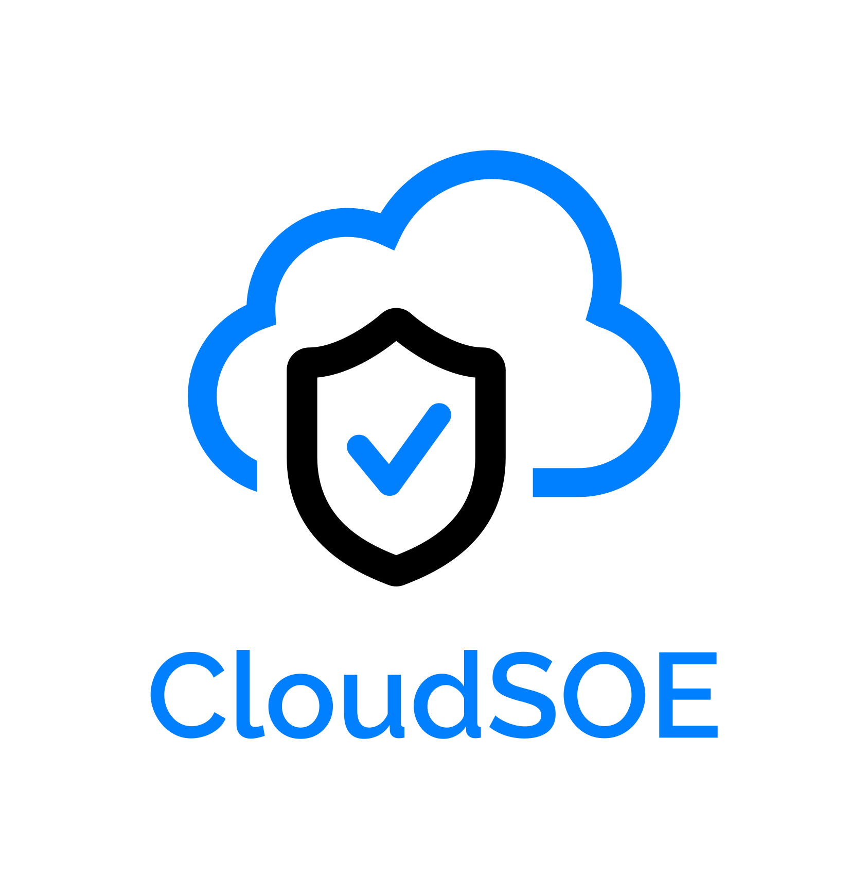

> Accelerating your IaaS deployments.

- Windows Server 2019 and Windows Server 2016 prototype
- Infrastructure-as-Code 
- Get insights from your Azure, on-premises, and other cloud workloads

## About this project

Welcome to the CloudSOE project - we're developing a community-driven, cloud-native, multi-platform Standard Operating Environment (SOE) for organisations that adopt Information Security Manual ([ISM](https://www.cyber.gov.au/acsc/view-all-content/ism)) guidelines when building information systems that use Virtual Machines.

The project uses a collection of cloud-native technologies to achieve desired outcomes for Azure (and in future, on-premises & multi-cloud) IaaS systems:

- Azure Image Builder
- Azure Policy & Guest Configuration
- Azure Monitor 
- Azure Automation
- Azure Automanage

The example code in this repository should be considered a functional prototype which you can learn from and apply in your own sandpit subscriptions.

## Getting started

Please see [getting started](https://aka.ms/cloudsoe/#/?id=getting-started) section of the docs for instructions on getting started

## Roadmap
We hope that future development of the CloudSOE project will be ✨community-driven✨. We can think of a number of enhancements that would improve the utility of the solution, such as:

- Simplify the setup process
- Test/build Azure Arc for on-premises and other cloud management
- Add Linux support
- Move to policy-based setting enforcement (i.e. not just audit)
- ESLZ integration
- Bicep Refactoring
- Review and implement delta guidelines since November 2020 ISM

## Contributing

This project welcomes contributions and suggestions!

When you submit a pull request, a CLA bot will automatically determine whether you need to provide
a CLA and decorate the PR appropriately (e.g., status check, comment). Simply follow the instructions
provided by the bot. You will only need to do this once across all repos using our CLA.

This project has adopted the [Microsoft Open Source Code of Conduct](https://opensource.microsoft.com/codeofconduct/).
For more information see the [Code of Conduct FAQ](https://opensource.microsoft.com/codeofconduct/faq/) or
contact [opencode@microsoft.com](mailto:opencode@microsoft.com) with any additional questions or comments.

## Trademarks

This project may contain trademarks or logos for projects, products, or services. Authorized use of Microsoft trademarks or logos is subject to and must follow 
[Microsoft's Trademark & Brand Guidelines](https://www.microsoft.com/en-us/legal/intellectualproperty/trademarks/usage/general).

Use of Microsoft trademarks or logos in modified versions of this project must not cause confusion or imply Microsoft sponsorship.
Any use of third-party trademarks or logos are subject to those third-party's policies.
